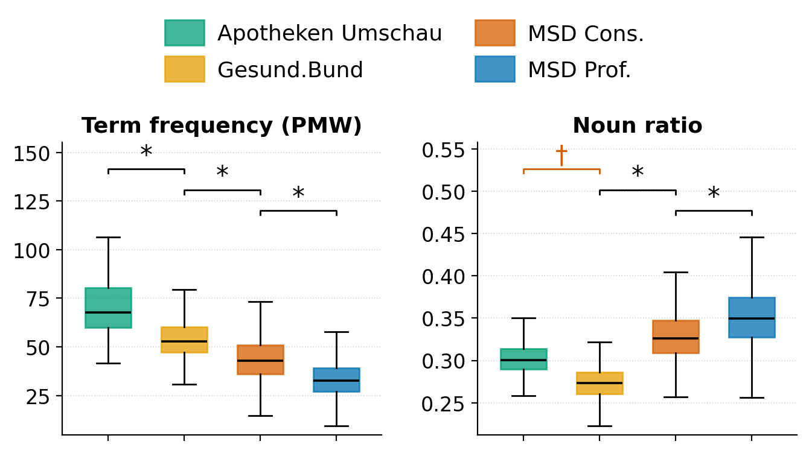
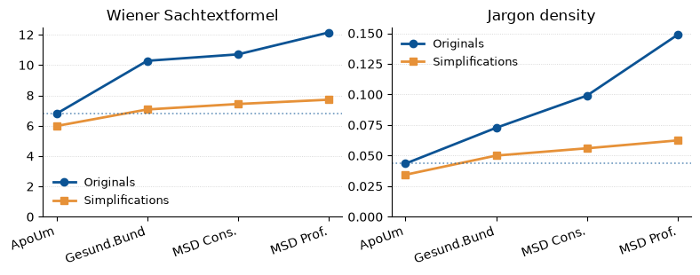

# PlainMedScale

Code accompanying **PlainMedScale: A Corpus of Multi-Level Simplified Medical
Texts in German and English**.

📄 **Paper:** [arxiv.org/abs/2608.01158](https://arxiv.org/abs/2608.01158)

💾 **Corpus/Data:** [doi:10.5281/zenodo.21728290](https://doi.org/10.5281/zenodo.21728290)
(subject to the access terms stated there)

---

Text simplification is often studied with binary corpora that align an 'expert' version of a text with a 'lay' version. Starting from the observation that text complexity operates on a scale, not a binary, we want to go beyond that, and introduce **PlainMedScale**, a corpus of medical texts aligned across four levels of expertise/complexity across German and English.

This allows us to study several hypotheses. For example, many readability metrics that work across binary corpora don't generalize to our multi-level corpus _(e.g. Noun ratio, see below)_.



We also test how LLMs perform in text simplification using these different levels of input complexity. They perform quite well, though output complexity is somewhat correlated with input complexity even when it shouldn't be.



**No source article text is stored in this repository** — the shipped data
files are alignment metadata and per-article metric numbers. The one exception
is `simplification/results/qwen3-30b/simplifications_{de,en}.tsv`, which holds
the model-generated simplifications produced by the §4.3 experiment.

## Layout

| Directory | Paper section | Contents |
|---|---|---|
| `alignment/candidates/` | §3.2 Stage 1+2 | Lexical alignment (SQLite FTS over ICD-10 / MeSH / DO / Pschyrembel dictionaries) and embedding-based alignment (`sqlitevec.py`, Qwen3-Embedding-8B). Notebooks build the dictionary/source DBs and run per-source search. |
| `alignment/judgment/` | §3.2 Stage 3 | LLM-based filtering: pair generation (`scripts/generate_full_pairs.py`, `scripts/verify_full_pairs.py`), the GPT-5.4-mini judge (`scripts/judge_full_alignment.py`), and merging of human + LLM judgments (`scripts/build_alignment_judgments.py`). Code only — its inputs and outputs live in `data/alignment/`. |
| `readability/pipelines/` | §4.1, App. A+B | The three metric pipelines (`pipeline_spacy.py`, `pipeline_llms.py`, `pipeline_jargon.py`) — article text in, per-article metric TSVs out. |
| `readability/reporting/` | §4.1, App. B | Table and figure generators reading those TSVs. Metric selection/labels come from `readability/metrics_config.toml`. |
| `readability/jargon/` | App. A | Keyness computation (`keyness/`) and the jargon classifier (`detection/simple_jargon_detector.py`). The large keyness TSVs are not in git — see `readability/jargon/keys/README.md`. |
| `simplification/` | §4.3 | Qwen3-30B-A3B simplification runs, bleed-through metrics, and the corresponding table/figure generators. `results/qwen3-30b/` contains the generated texts and their per-article metrics. |
| `data/` | — | Derived numbers only, no article text — metric TSVs, `alignment/` metadata, `alignment_index.json`. The corpus goes in `data/corpus/` from Zenodo. See `data/README.md`. |

`REPRODUCING.md` maps every table and figure of the paper to the command that
regenerates it.

## Setup

Requires Python ≥ 3.12 and [uv](https://docs.astral.sh/uv/):

```bash
uv sync
uv run python -m spacy download de_core_news_lg
uv run python -m spacy download en_core_web_lg
```

All commands below are run from the repo root. The metric pipelines import
their shared library via `PYTHONPATH=readability`.

## Data

Download the corpus release from Zenodo (doi:10.5281/zenodo.21728290) into
`data/corpus/`. Every pipeline reads those files directly — there is no
conversion step:

```
data/corpus/
    msd_professional_{de,en}.json   msd_amateur_{de,en}.json
    msd_short_{de,en}.json          gesund_bund_{de,en}.json
    apoum_de.json                   nhs_en.json
```

Each file is a list of article records with `instance_id`, `article_id`,
`title`, `paragraphs` (Markdown) and `plain_text` (flattened prose). The
metric pipelines score `plain_text`; the simplification experiment feeds the
model the Markdown rebuilt from `title` + `paragraphs`, so it mirrors the
structure back. `lib/corpus.py` holds the file table and the loaders — add a
new source there, not in the individual pipelines.

Note that alignment stages 1–2 (`alignment/candidates/`) predate the release: they were run
on the original crawl output, of which the release is the published form.

## Running the pipelines

Reproducing the paper's tables/figures does **not** require this step — the
per-article metric TSVs are shipped in `data/`. To recompute them:

```bash
# Classical readability metrics (CPU)
PYTHONPATH=readability python readability/pipelines/pipeline_spacy.py \
    --table-mode strip --output-dir data/metrics_strip

# LLM-based metrics: GPT-2 perplexity, BERT NSP / masked LM (GPU)
PYTHONPATH=readability python readability/pipelines/pipeline_llms.py \
    --table-mode strip --output-dir data/metrics_llm_strip

# Jargon density (needs the keyness TSVs, see readability/jargon/keys/README.md)
PYTHONPATH=readability python readability/pipelines/pipeline_jargon.py \
    --output-dir data/jargon_density
```

All pipelines **resume by default** (existing `article_id`s in the output TSV
are skipped); pass `--overwrite` for a clean run. SLURM wrappers for an HPC
cluster are provided (`readability/pipelines/run_spacy.sh`, `readability/pipelines/run_llms.sh`,
`simplification/run_simplify.sh`).

Known schema quirk kept for compatibility: the LLM pipeline's fulltext
perplexity column is named `apll_full_median` (sic).

Every output row is keyed on the release's own `article_id`, so metric TSVs
join directly against the corpus files.

## Alignment

Stages 1+2 are notebook-driven (`alignment/candidates/*.ipynb`): the `*_db` notebooks build
SQLite databases from the reference vocabularies and source articles,
`search_*.ipynb` run lexical + embedding lookup per source, and
`align_instances.ipynb` assembles cross-source clusters. Stage 3:

```bash
# Build + sanity-check the deduplicated pair list
python alignment/judgment/scripts/generate_full_pairs.py
python alignment/judgment/scripts/verify_full_pairs.py

# The MSD amateur-title view, shipped alongside as a sidecar
python alignment/judgment/scripts/generate_full_pairs.py --msd-title amateur

# LLM judge over all pairs (OpenAI API)
OPENAI_API_KEY=... python alignment/judgment/scripts/judge_full_alignment.py \
    --pairs data/alignment/full_pairs_filtered.tsv \
    --model gpt-5.4-mini --output-dir alignment/judgment/results/full_align_judge

# Merge human + LLM judgments into alignment_judgments.json
python alignment/judgment/scripts/build_alignment_judgments.py
```

The outputs of the full run are shipped
(`data/alignment/alignment_judgments*.json`), so downstream steps work
without re-running the judge.

## Simplification experiment

```bash
# Build the instance index from the alignment artifacts
python simplification/build_alignment_index.py

# Generate simplifications (Qwen3-30B-A3B-Instruct-2507; one job per language)
LANGUAGE=de sbatch simplification/run_simplify.sh
LANGUAGE=en sbatch simplification/run_simplify.sh

# Metrics over the generated texts
sbatch simplification/run_pipeline_metrics_llm.sh
```

The full run is shipped under `simplification/results/qwen3-30b/`: the
per-article metrics *and* the generated texts themselves,
`simplifications_{de,en}.tsv` (3,561 DE + 3,824 EN rows). Columns:

```
language  source  subtree  instance_id  source_word_count
generation_time_s  simplified_text
```

Join back to `data/alignment_index.json` on `(source, subtree, instance_id)`
if you need `cluster_id` / `bucket` / `tier` / `title`.

These are model outputs, but they paraphrase the source articles — treat them
under the same terms as the corpus release. The pipeline's `raw_response`
column is not shipped: this run had no thinking blocks, so it duplicates
`simplified_text`.

## Tests

```bash
PYTHONPATH=readability uv run pytest readability/tests
```

## Citation

```bibtex
@misc{brocai2026plainmedscalecorpusmultilevelsimplified,
      title={PlainMedScale: A Corpus of Multi-Level Simplified Medical Texts in German and English},
      author={Bruno Brocai and Ilaria Papagno and Mayumi Ohta},
      year={2026},
      eprint={2608.01158},
      archivePrefix={arXiv},
      primaryClass={cs.CL},
      url={https://arxiv.org/abs/2608.01158},
}
```

## AI Declaration

We acknowledge the use of LLMs in the development of this repository, including for coding assistance, for generating the documentation and for preparing the publication version of this code.
